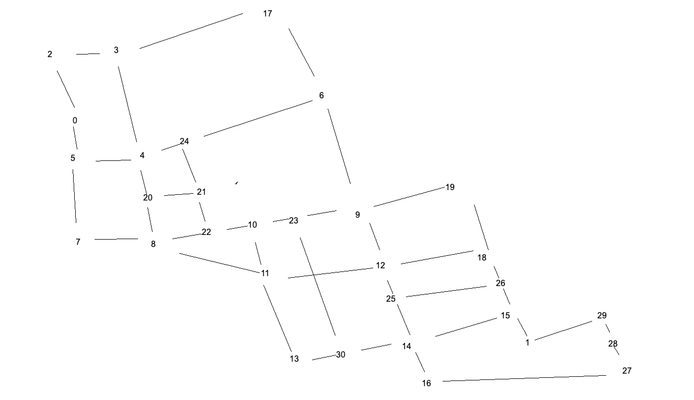

# K-th Shortest Path Visualization
This project aims to find and visualize the k-th shortest path between Ho Chi Minh City University of Technology (HCMUT) and Independence Palace, Vietnam.

## Data preparation
To achieve the mission, I choose 31 position between HCMUT and Independence Place. Then, I conduct the graph using Google Distance Matrix API.

### Map
The following picture is the graph I have conducted. Node 0 is HCMUT. Node 1 is Independence Place.

## Algorithm
I use Yen's algorithm to find the k-th shortest path and Bellman Ford, Floy Warshal, Dijkstra to find the 1st shortest path.

Reference can be found at:
* https://en.wikipedia.org/wiki/Yen%27s_algorithm
* https://www.linchenguang.com/2018/01/30/Yen-s-algorithm

## Visualization
I use Google Map Embed API to visualize the result.
### The 1st shortest path
Distance: 6.620 meter

Path: [268 Lý Thường Kiệt, Phường 14, Quận 10, Thành phố Hồ Chí Minh, Vietnam] -> [270 B, Lý Thường Kiệt, Phường 14, Quận 10, Thành phố Hồ Chí Minh, Vietnam] -> [10.780678,106.658833] -> [175 Đ. Thành Thái, Phường 14, Quận 10, Thành phố Hồ Chí Minh, Vietnam] -> [307A, Số Cũ/155A Tô Hiến Thành, Quận 10, Thành phố Hồ Chí Minh 700000, Vietnam] -> [10.782881,106.672134] -> [Binh, Đ. Võ Thị Sáu Vòng Xoay Công Trường Dân Chủ, & Bùng, Quận 3, Thành phố Hồ Chí Minh, Vietnam] -> [241Bis Đ. Cách Mạng Tháng 8, Phường 4, Quận 3, Thành phố Hồ Chí Minh 700000, Vietnam] -> [90 Đ. Cách Mạng Tháng 8, Phường 6, Quận 3, Thành phố Hồ Chí Minh, Vietnam] -> [10.773615,106.689442] -> [10.779552,106.694980] -> [45 Hàn Thuyên, Bến Nghé, Quận 11, Thành phố Hồ Chí Minh, Vietnam]

### The 2nd shortest path
Distance: 7.065 meter

Path: [268 Lý Thường Kiệt, Phường 14, Quận 10, Thành phố Hồ Chí Minh, Vietnam] -> [270 B, Lý Thường Kiệt, Phường 14, Quận 10, Thành phố Hồ Chí Minh, Vietnam] -> [10.780678,106.658833] -> [175 Đ. Thành Thái, Phường 14, Quận 10, Thành phố Hồ Chí Minh, Vietnam] -> [88 Đ. Thành Thái, Phường 12, Quận 10, Thành phố Hồ Chí Minh, Vietnam] -> [Chago, 816 Đ. Sư Vạn Hạnh, Phường 12, Quận 10, Thành phố Hồ Chí Minh, Vietnam] -> [10.769610,106.670836] -> [231 Đ. 3 Tháng 2, Phường 10, Quận 10, Thành phố Hồ Chí Minh, Vietnam] -> [10.773795,106.677803] -> [Binh, Đ. Võ Thị Sáu Vòng Xoay Công Trường Dân Chủ, & Bùng, Quận 3, Thành phố Hồ Chí Minh, Vietnam] -> [241Bis Đ. Cách Mạng Tháng 8, Phường 4, Quận 3, Thành phố Hồ Chí Minh 700000, Vietnam] -> [90 Đ. Cách Mạng Tháng 8, Phường 6, Quận 3, Thành phố Hồ Chí Minh, Vietnam] -> [10.773615,106.689442] -> [10.779552,106.694980] -> [45 Hàn Thuyên, Bến Nghé, Quận 11, Thành phố Hồ Chí Minh, Vietnam]
### The 3rd shortest path
Distance: 7.101 meter

Path: [268 Lý Thường Kiệt, Phường 14, Quận 10, Thành phố Hồ Chí Minh, Vietnam] -> [270 B, Lý Thường Kiệt, Phường 14, Quận 10, Thành phố Hồ Chí Minh, Vietnam] -> [10.780678,106.658833] -> [175 Đ. Thành Thái, Phường 14, Quận 10, Thành phố Hồ Chí Minh, Vietnam] -> [307A, Số Cũ/155A Tô Hiến Thành, Quận 10, Thành phố Hồ Chí Minh 700000, Vietnam] -> [Chago, 816 Đ. Sư Vạn Hạnh, Phường 12, Quận 10, Thành phố Hồ Chí Minh, Vietnam] -> [10.769610,106.670836] -> [231 Đ. 3 Tháng 2, Phường 10, Quận 10, Thành phố Hồ Chí Minh, Vietnam] -> [10.773795,106.677803] -> [Binh, Đ. Võ Thị Sáu Vòng Xoay Công Trường Dân Chủ, & Bùng, Quận 3, Thành phố Hồ Chí Minh, Vietnam] -> [241Bis Đ. Cách Mạng Tháng 8, Phường 4, Quận 3, Thành phố Hồ Chí Minh 700000, Vietnam] -> [90 Đ. Cách Mạng Tháng 8, Phường 6, Quận 3, Thành phố Hồ Chí Minh, Vietnam] -> [10.773615,106.689442] -> [10.779552,106.694980] -> [45 Hàn Thuyên, Bến Nghé, Quận 11, Thành phố Hồ Chí Minh, Vietnam]
